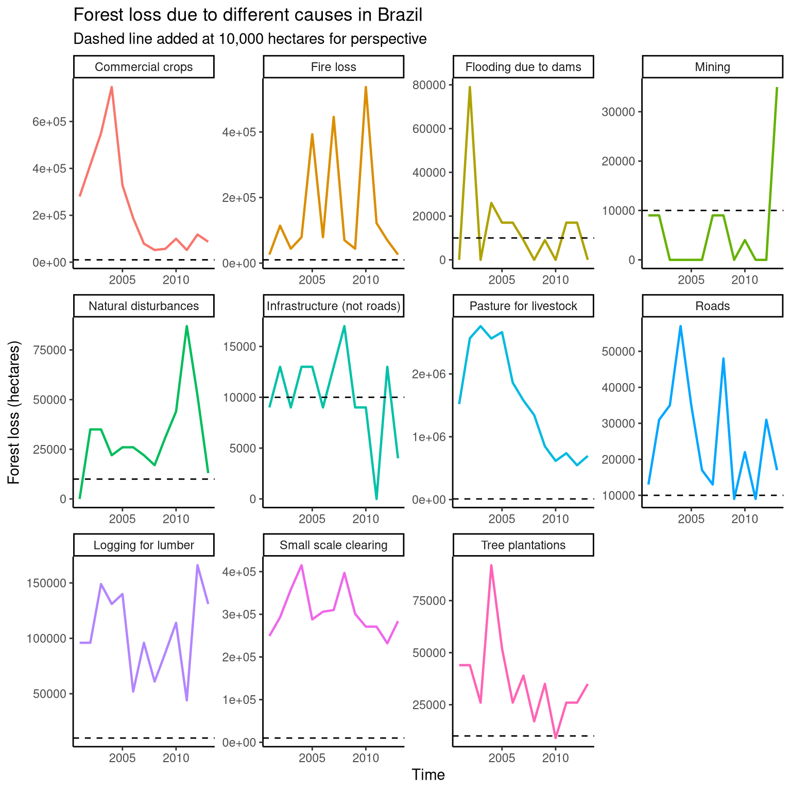
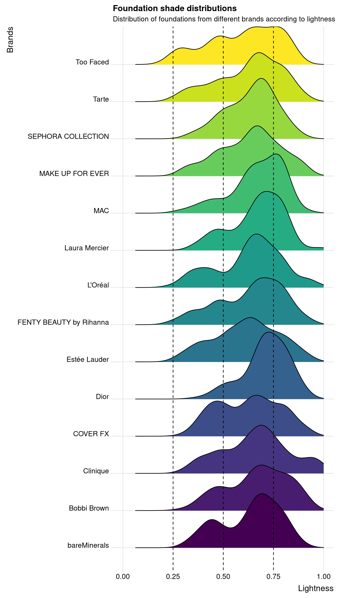
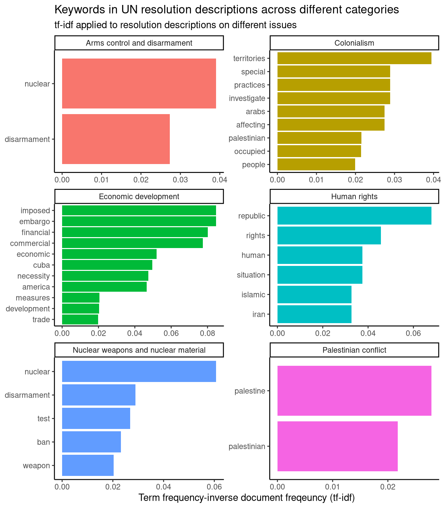
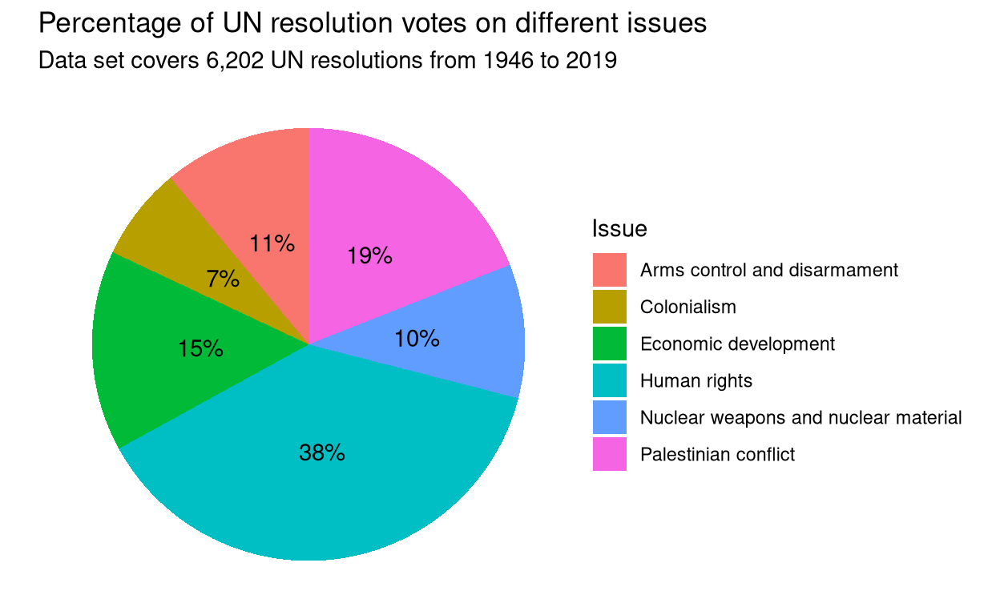
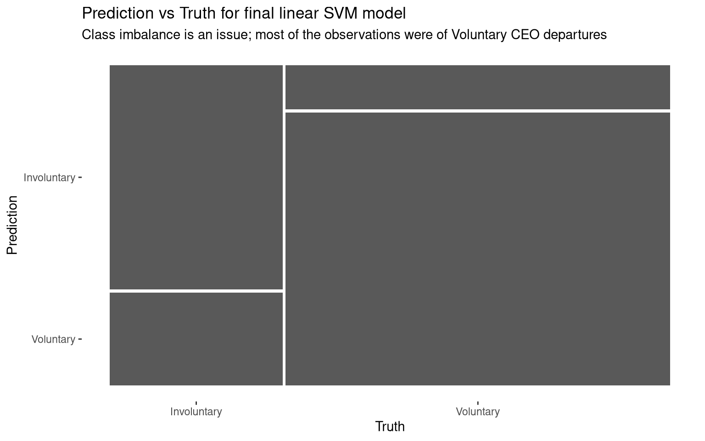
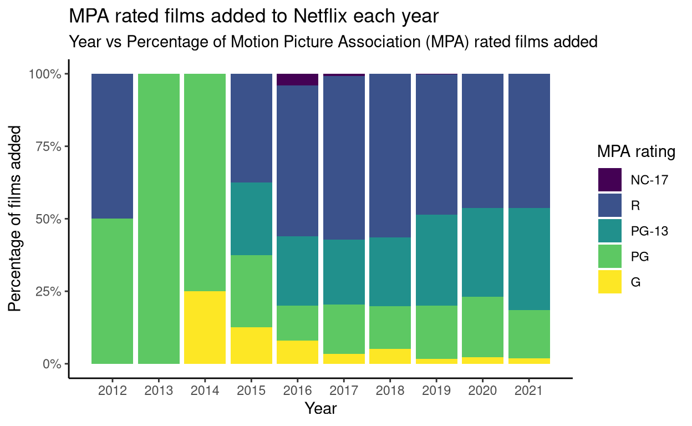
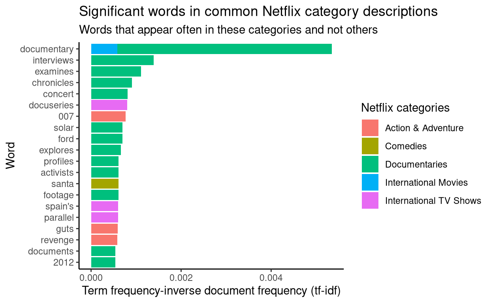

# [TidyTuesday](https://github.com/rnnh/TidyTuesday/)

by [Ronan Harrington](https://github.com/rnnh/)

***As featured on [R-bloggers.com](https://www.r-bloggers.com/author/ronan-harrington/)*** | ***<https://tidytuesday.netlify.app/>***

- [Intro](#intro)
- [Posts](#posts)
- [Graph Gallery](#graph-gallery)
- [References](#references)

## Intro

This blog provides reproducible examples of data wrangling, visualisation, and analysis in [R](https://www.r-project.org/) using [#TidyTuesday data sets](https://github.com/rfordatascience/tidytuesday), created with [distill for R Markdown](https://github.com/rstudio/distill).
These data sets are provided by the [R for Data Science (R4DS)](https://github.com/rfordatascience) community.
This blog can be viewed locally by downloading this GitHub repository and opening [the index page](_site/index.html) in a web browser.
External links for each post as well as the R Markdown and R source files are provided in the [README](https://github.com/rnnh/TidyTuesday/blob/main/README.md#posts) file.
Full article content via [RSS is now available](https://github.com/rnnh/TidyTuesday/commit/3608329d5a880c6d9647c0d4e21c9763388de618) though this blog's [index.xml](https://tidytuesday.netlify.app/index.xml) page.

## Posts

| Year | Week | Data Set | Blog post | R Markdown source | R source | External links | Preview Plot |
| ---- | ---- | -------- | --------- | ----------------- | -------- | -------------- | ----- |
| 2022 | 29   | [Technology Adoption](https://github.com/rfordatascience/tidytuesday/blob/master/data/2022/2022-07-19/readme.md) | [Adding continent and country names with {countrycode}, and subsetting a data frame using sample()](https://tidytuesday.netlify.app/posts/2022-07-21-technology-adoption/) | [technology-adoption.Rmd](_posts/2022-07-21-technology-adoption/technology-adoption.Rmd) | [technology-adoption.R](_posts/2022-07-21-technology-adoption/technology-adoption.R) | [@Rbloggers](https://twitter.com/Rbloggers/status/1549925864686632961) [r-bloggers.com](https://r-bloggers.com/?p=329290) |  |
| 2022 | 28   | [European Flights](https://github.com/rfordatascience/tidytuesday/blob/master/data/2022/2022-07-12/readme.md) | [How to write a function in R and apply it to a data frame using map functions from {purr}](https://tidytuesday.netlify.app/posts/2022-07-12-european-flights/) | [european-flights.Rmd](_posts/2022-07-12-european-flights/european-flights.Rmd) | [european-flights.R](_posts/2022-07-12-european-flights/european-flights.R) | [@Rbloggers](https://twitter.com/Rbloggers/status/1547117375539093504) [r-bloggers.com](https://r-bloggers.com/?p=328786) |  |
| 2022 | 27   | [San Francisco Rentals](https://github.com/rfordatascience/tidytuesday/blob/master/data/2022/2022-07-05/readme.md) | [Reshaping data frames using pivot functions from {tidyr} and tally from {dplyr}](https://tidytuesday.netlify.app/posts/2022-07-05-sf-rents/) | [sf-rents.Rmd](_posts/2022-07-05-sf-rents/sf-rents.Rmd) | [sf-rents.R](_posts/2022-07-05-sf-rents/sf-rents.R) | [@Rbloggers](https://twitter.com/Rbloggers/status/1544501380534108160) [r-bloggers.com](https://r-bloggers.com/?p=328313) |  |
| 2022 | 3    | [Chocolate Bar ratings](https://github.com/rfordatascience/tidytuesday/blob/master/data/2022/2022-01-18/readme.md) | [Text Mining Chocolate Bar Characteristics with {tidytext}](https://tidytuesday.netlify.app/posts/2022-01-26-chocolate-bar-ratings/) | [chocolate-bar-ratings.Rmd](_posts/2022-01-26-chocolate-bar-ratings/chocolate-bar-ratings.Rmd) | [chocolate-bar-ratings.R](_posts/2022-01-26-chocolate-bar-ratings/chocolate-bar-ratings.R) | [@Rbloggers](https://twitter.com/Rbloggers/status/1486507975216930821) [r-bloggers.com](https://r-bloggers.com/?p=236924) |  |
| 2022 | 2    | [Bee Colony losses](https://github.com/rfordatascience/tidytuesday/blob/master/data/2022/2022-01-11/readme.md) | [Plotting Bee Colony Observations and Distributions using {ggbeeswarm} and {geomtextpath}](https://tidytuesday.netlify.app/posts/2022-01-23-bee-colony-losses/) | [bee-colony-losses.Rmd](_posts/2022-01-23-bee-colony-losses/bee-colony-losses.Rmd) | [bee-colony-losses.R](_posts/2022-01-23-bee-colony-losses/bee-colony-losses.R) | [@Rbloggers](https://twitter.com/Rbloggers/status/1485409486345015296) [r-bloggers.com](https://r-bloggers.com/?p=236772) |  |
| 2021 | 34   | [Star Trek voice commands](https://github.com/rfordatascience/tidytuesday/blob/master/data/2021/2021-08-17/readme.md) | [Text mining Star Trek dialogue and classifying characters using machine learning](https://tidytuesday.netlify.app/posts/2021-08-18-star-trek-voice-commands/) | [star-trek-voice-commands.Rmd](_posts/2021-08-18-star-trek-voice-commands/star-trek-voice-commands.Rmd) | [star-trek-voice-commands.R](_posts/2021-08-18-star-trek-voice-commands/star-trek-voice-commands.R) | [@Rbloggers](https://twitter.com/Rbloggers/status/1428019352239022081) [r-bloggers.com](https://r-bloggers.com/?p=226189) |  |
| 2021 | 33   | [BEA Infrastructure Investment](https://github.com/rfordatascience/tidytuesday/blob/master/data/2021/2021-08-10/readme.md) | [Adjusting variable distribution and exploring data using mass linear regression](https://tidytuesday.netlify.app/posts/2021-08-15-bea-infrastructure-investment/) | [bea-infrastructure-investment.Rmd](_posts/2021-08-15-bea-infrastructure-investment/bea-infrastructure-investment.Rmd) | [bea-infrastructure-investment.R](_posts/2021-08-15-bea-infrastructure-investment/bea-infrastructure-investment.R) | [@Rbloggers](https://twitter.com/Rbloggers/status/1427075618223575046) [r-bloggers.com](https://r-bloggers.com/?p=226037) |  |
| 2021 | 18   | [CEO Departures](https://github.com/rfordatascience/tidytuesday/blob/master/data/2021/2021-04-27/readme.md) | [Predicting voluntary CEO departures using machine learning](https://tidytuesday.netlify.app/posts/2021-04-27-ceo-departures/) | [ceo-departures.Rmd](https://github.com/rnnh/TidyTuesday/blob/main/_posts/2021-04-27-ceo-departures/ceo-departures.Rmd) | [ceo-departures.R](https://github.com/rnnh/TidyTuesday/blob/main/_posts/2021-04-27-ceo-departures/ceo-departures.R) | [@Rbloggers](https://twitter.com/Rbloggers/status/1417351534204047371) [r-bloggers.com](https://r-bloggers.com/?p=224585) |  |
| 2021 | 17   | [Netflix Titles](https://github.com/rfordatascience/tidytuesday/blob/master/data/2021/2021-04-20/readme.md) | [Films with MPA ratings on Netflix](https://tidytuesday.netlify.app/posts/2021-04-21-netflix-titles/) | [netflix-titles.Rmd](_posts/2021-04-21-netflix-titles/netflix-titles.Rmd) | [netflix-titles.R](_posts/2021-04-21-netflix-titles/netflix-titles.R) | [@Rbloggers](https://twitter.com/Rbloggers/status/1417351574398062615) [r-bloggers.com](https://r-bloggers.com/?p=224587) |  |
| 2021 | 16   | [US Post Offices](https://github.com/rfordatascience/tidytuesday/blob/master/data/2021/2021-04-13/readme.md) | [Post offices in the USA from 1772 to 2000](https://tidytuesday.netlify.app/posts/2021-04-16-us-post-offices/) | [us-post-offices.Rmd](_posts/2021-04-16-us-post-offices/us-post-offices.Rmd) | [us-post-offices.R](_posts/2021-04-16-us-post-offices/us-post-offices.R) | [@Rbloggers](https://twitter.com/Rbloggers/status/1417496248446328839) [r-bloggers.com](https://r-bloggers.com/?p=224626) |   |
| 2021 | 15   | [Global Deforestation](https://github.com/rfordatascience/tidytuesday/blob/master/data/2021/2021-04-06/readme.md) | [Plotting deforestation and its causes](https://tidytuesday.netlify.app/posts/2021-04-07-global-deforestation/) | [global-deforestation.Rmd](_posts/2021-04-07-global-deforestation/global-deforestation.Rmd) | [global-deforestation.R](_posts/2021-04-07-global-deforestation/global-deforestation.R) | [@Rbloggers](https://twitter.com/Rbloggers/status/1417623342530576385) [r-bloggers.com](https://r-bloggers.com/?p=224656) |   |
| 2021 | 14   | [Makeup Shades](https://github.com/rfordatascience/tidytuesday/blob/master/data/2021/2021-03-30/readme.md) | [Plotting foundations according to shade](https://tidytuesday.netlify.app/posts/2021-04-06-makeup-shades/) | [makeup-shades.Rmd](_posts/2021-04-06-makeup-shades/makeup-shades.Rmd) | [makeup-shades.R](_posts/2021-04-06-makeup-shades/makeup-shades.R) | [@Rbloggers](https://twitter.com/Rbloggers/status/1417804515475136518) [r-bloggers.com](https://r-bloggers.com/?p=224706) |    |
| 2021 | 13   | [UN Votes](https://github.com/rfordatascience/tidytuesday/blob/master/data/2021/2021-03-23/readme.md) | [UN Votes: Plotting votes on United Nations resolutions](https://tidytuesday.netlify.app/posts/2021-03-30-un-votes/) | [un-votes.Rmd](_posts/2021-03-30-un-votes/un-votes.Rmd) | [un-votes.R](_posts/2021-03-30-un-votes/un-votes.R) | [@Rbloggers](https://twitter.com/Rbloggers/status/1417804550036246528) [r-bloggers.com](https://r-bloggers.com/?p=224708) |     |
| 2021 | 12   | [Video Games + Sliced](https://github.com/rfordatascience/tidytuesday/blob/master/data/2021/2021-03-16/readme.md) | [Video Games and Sliced](https://tidytuesday.netlify.app/posts/2021-03-23-video-games-and-sliced/) | [video-games-and-sliced.Rmd](_posts/2021-03-23-video-games-and-sliced/video-games-and-sliced.Rmd) | [video-games-and-sliced.R](_posts/2021-03-23-video-games-and-sliced/video-games-and-sliced.R) | [@Rbloggers](https://twitter.com/Rbloggers/status/1417937931675766790) [r-bloggers.com](https://r-bloggers.com/?p=224740) |   |
| 2021 | 11   | [Bechdel Test](https://github.com/rfordatascience/tidytuesday/blob/master/data/2021/2021-03-09/readme.md) | [Bechdel Test](https://tidytuesday.netlify.app/posts/2021-03-21-bechdel-test/) | [bechdel-test.Rmd](_posts/2021-03-21-bechdel-test/bechdel-test.Rmd) | [bechdel-test.R](_posts/2021-03-21-bechdel-test/bechdel-test.R) | [@Rbloggers](https://twitter.com/Rbloggers/status/1418109114035675140) [r-bloggers.com](https://r-bloggers.com/?p=224787) |    |

## Graph Gallery

| R Markdown source | Graph |
| ---- | ----- |
| [technology-adoption.Rmd](_posts/2022-07-21-technology-adoption/technology-adoption.Rmd) |  |
| [technology-adoption.Rmd](_posts/2022-07-21-technology-adoption/technology-adoption.Rmd) |  |
| [sf-rents.Rmd](_posts/2022-07-05-sf-rents/sf-rents.Rmd) |  |
| [sf-rents.Rmd](_posts/2022-07-05-sf-rents/sf-rents.Rmd) |  |
| [chocolate-bar-ratings.Rmd](_posts/2022-01-26-chocolate-bar-ratings/chocolate-bar-ratings.Rmd) |  |
| [chocolate-bar-ratings.Rmd](_posts/2022-01-26-chocolate-bar-ratings/chocolate-bar-ratings.Rmd) |  |
| [bee-colony-losses.Rmd](_posts/2022-01-23-bee-colony-losses/bee-colony-losses.Rmd) |  |
| [bee-colony-losses.Rmd](_posts/2022-01-23-bee-colony-losses/bee-colony-losses.Rmd) |  |
| [bee-colony-losses.Rmd](_posts/2022-01-23-bee-colony-losses/bee-colony-losses.Rmd) |  |
| [star-trek-voice-commands.Rmd](_posts/2021-08-18-star-trek-voice-commands/star-trek-voice-commands.Rmd) |  |
| [star-trek-voice-commands.Rmd](_posts/2021-08-18-star-trek-voice-commands/star-trek-voice-commands.Rmd) |  |
| [star-trek-voice-commands.Rmd](_posts/2021-08-18-star-trek-voice-commands/star-trek-voice-commands.Rmd) |  |
| [star-trek-voice-commands.Rmd](_posts/2021-08-18-star-trek-voice-commands/star-trek-voice-commands.Rmd) |  |
| [star-trek-voice-commands.Rmd](_posts/2021-08-18-star-trek-voice-commands/star-trek-voice-commands.Rmd) |  |
| [ceo-departures.Rmd](https://github.com/rnnh/TidyTuesday/blob/main/_posts/2021-04-27-ceo-departures/ceo-departures.Rmd) |  |
| [ceo-departures.Rmd](https://github.com/rnnh/TidyTuesday/blob/main/_posts/2021-04-27-ceo-departures/ceo-departures.Rmd) |  |
| [netflix-titles.Rmd](_posts/2021-04-21-netflix-titles/netflix-titles.Rmd) |  |
| [netflix-titles.Rmd](_posts/2021-04-21-netflix-titles/netflix-titles.Rmd) |  |
| [netflix-titles.Rmd](_posts/2021-04-21-netflix-titles/netflix-titles.Rmd) |  |

## References

- Favicon from [OpenMoji 13.0](https://github.com/hfg-gmuend/openmoji/releases/tag/13.0.0)
