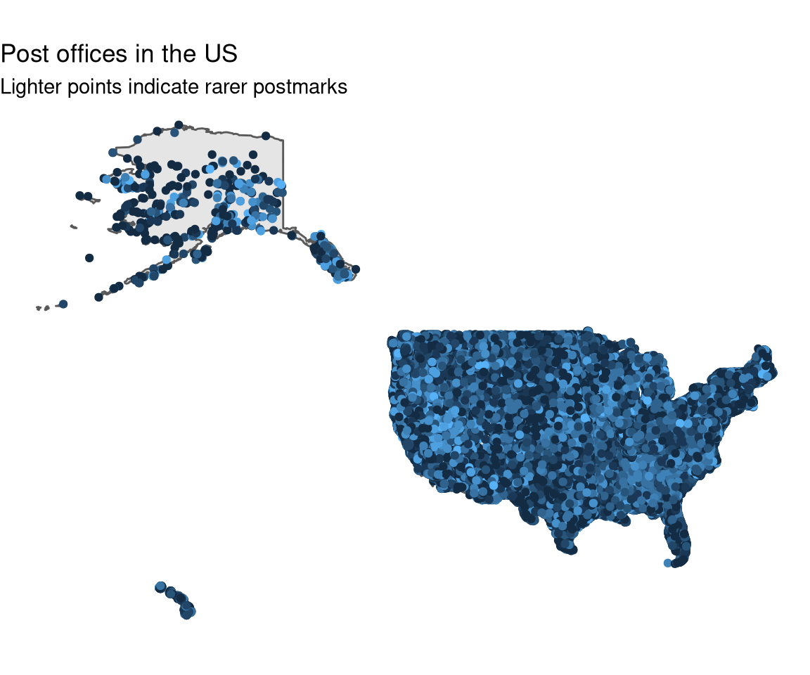

# [TidyTuesday](https://github.com/rnnh/TidyTuesday/)

by [Ronan Harrington](https://github.com/rnnh/)

Reproducible visualisation and analysis of [#TidyTuesday data sets](https://github.com/rfordatascience/tidytuesday), created using [distill for R Markdown](https://github.com/rstudio/distill).
These data sets are provided by the [R for Data Science (R4DS)](https://github.com/rfordatascience) community.
This blog can be viewed locally by downloading this GitHub repository and opening [the index page](_site/index.html) in a web browser.
It is also available at **<https://tidytuesday.netlify.app/>**.
Full article content via [RSS is now available](https://github.com/rnnh/TidyTuesday/commit/3608329d5a880c6d9647c0d4e21c9763388de618) though this blog's [index.xml](https://tidytuesday.netlify.app/index.xml) page.

## Posts

| Year | Week | Data Set | Blog post | R Markdown source | Preview plot |
| ---- | ---- | -------- | --------- | ---------------- | ------------ |
| 2021 | 18   | [CEO Departures](https://github.com/rfordatascience/tidytuesday/blob/master/data/2021/2021-04-27/readme.md) | [Predicting voluntary CEO departures using machine learning](https://tidytuesday.netlify.app/posts/2021-04-27-ceo-departures/) | [ceo-departures.Rmd](https://github.com/rnnh/TidyTuesday/blob/main/_posts/2021-04-27-ceo-departures/ceo-departures.Rmd) |  |
| 2021 | 17   | [Netflix Titles](https://github.com/rfordatascience/tidytuesday/blob/master/data/2021/2021-04-20/readme.md) | [Films with MPA ratings on Netflix](https://tidytuesday.netlify.app/posts/2021-04-21-netflix-titles/) | [netflix-titles.Rmd](_posts/2021-04-21-netflix-titles/netflix-titles.Rmd) |  |
| 2021 | 16   | [US Post Offices](https://github.com/rfordatascience/tidytuesday/blob/master/data/2021/2021-04-13/readme.md) | [Post offices in the USA from 1772 to 2000](https://tidytuesday.netlify.app/posts/2021-04-16-us-post-offices/) | [us-post-offices.Rmd](_posts/2021-04-16-us-post-offices/us-post-offices.Rmd) |  |
| 2021 | 15   | [Global Deforestation](https://github.com/rfordatascience/tidytuesday/blob/master/data/2021/2021-04-06/readme.md) | [Plotting deforestation and its causes](https://tidytuesday.netlify.app/posts/2021-04-07-global-deforestation/) | [global-deforestation.Rmd](_posts/2021-04-07-global-deforestation/global-deforestation.Rmd) |  |
| 2021 | 14   | [Makeup Shades](https://github.com/rfordatascience/tidytuesday/blob/master/data/2021/2021-03-30/readme.md) | [Plotting foundations according to shade](https://tidytuesday.netlify.app/posts/2021-04-06-makeup-shades/) | [makeup-shades.Rmd](_posts/2021-04-06-makeup-shades/makeup-shades.Rmd) |  |
| 2021 | 13   | [UN Votes](https://github.com/rfordatascience/tidytuesday/blob/master/data/2021/2021-03-23/readme.md) | [UN Votes: Plotting votes on United Nations resolutions](https://tidytuesday.netlify.app/posts/2021-03-30-un-votes/) | [un-votes.Rmd](_posts/2021-03-30-un-votes/un-votes.Rmd) |  |
| 2021 | 12   | [Video Games + Sliced](https://github.com/rfordatascience/tidytuesday/blob/master/data/2021/2021-03-16/readme.md) | [Video Games and Sliced](https://tidytuesday.netlify.app/posts/2021-03-23-video-games-and-sliced/) | [video-games-and-sliced.Rmd](_posts/2021-03-23-video-games-and-sliced/video-games-and-sliced.Rmd) |  |
| 2021 | 11   | [Bechdel Test](https://github.com/rfordatascience/tidytuesday/blob/master/data/2021/2021-03-09/readme.md) | [Bechdel Test](https://tidytuesday.netlify.app/posts/2021-03-21-bechdel-test/) | [bechdel-test.Rmd](_posts/2021-03-21-bechdel-test/bechdel-test.Rmd)|  |

## References

- Favicon from [OpenMoji 13.0](https://github.com/hfg-gmuend/openmoji/releases/tag/13.0.0)
