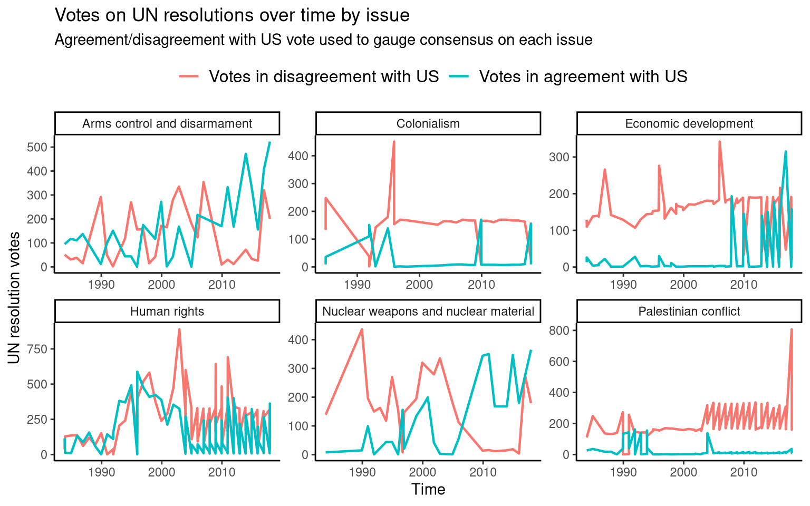

# [TidyTuesday](https://github.com/rnnh/TidyTuesday/)

by [Ronan Harrington](https://github.com/rnnh/)

Reproducible visualisation and analysis of [#TidyTuesday data sets](https://github.com/rfordatascience/tidytuesday), created using [distill for R Markdown](https://github.com/rstudio/distill). These datasets are provided by the [R for Data Science (R4DS)](https://github.com/rfordatascience) community. This blog is [available at `tidytuesday.netlify.app`](https://tidytuesday.netlify.app/). It can also be viewed locally by downloading this GitHub repository and opening [the index page](_site/index.html) in a web browser.

## Posts

| Year | Week | Data Set | Blog post | Rmarkdown source | Preview plot |
| ---- | ---- | -------- | --------- | ---------------- | ------------ |
| 2021 | 17   | [Netflix Titles](https://github.com/rfordatascience/tidytuesday/blob/master/data/2021/2021-04-20/readme.md) | [2021-04-21-netflix-titles](https://tidytuesday.netlify.app/posts/2021-04-21-netflix-titles/) | [netflix-titles.Rmd](_posts/2021-04-21-netflix-titles/netflix-titles.Rmd) |  |
| 2021 | 16   | [US Post Offices](https://github.com/rfordatascience/tidytuesday/blob/master/data/2021/2021-04-13/readme.md) | [2021-04-16-us-post-offices](https://tidytuesday.netlify.app/posts/2021-04-16-us-post-offices/) | [us-post-offices.Rmd](_posts/2021-04-16-us-post-offices/us-post-offices.Rmd) |  |
| 2021 | 15   | [Global Deforestation](https://github.com/rfordatascience/tidytuesday/blob/master/data/2021/2021-04-06/readme.md) | [2021-04-07-global-deforestation](https://tidytuesday.netlify.app/posts/2021-04-07-global-deforestation/) | [global-deforestation.Rmd](_posts/2021-04-07-global-deforestation/global-deforestation.Rmd) |  |
| 2021 | 14   | [Makeup Shades](https://github.com/rfordatascience/tidytuesday/blob/master/data/2021/2021-03-30/readme.md) | [2021-04-06-makeup-shades](https://tidytuesday.netlify.app/posts/2021-04-06-makeup-shades/) | [makeup-shades.Rmd](_posts/2021-04-06-makeup-shades/makeup-shades.Rmd) |  |
| 2021 | 13   | [UN Votes](https://github.com/rfordatascience/tidytuesday/blob/master/data/2021/2021-03-23/readme.md) | [2021-03-30-un-votes](https://tidytuesday.netlify.app/posts/2021-03-30-un-votes/) | [un-votes.Rmd](_posts/2021-03-30-un-votes/un-votes.Rmd) |  |
| 2021 | 12   | [Video Games + Sliced](https://github.com/rfordatascience/tidytuesday/blob/master/data/2021/2021-03-16/readme.md) | [2021-03-23-video-games-and-sliced](https://tidytuesday.netlify.app/posts/2021-03-23-video-games-and-sliced/) | [video-games-and-sliced.Rmd](_posts/2021-03-23-video-games-and-sliced/video-games-and-sliced.Rmd) |  |
| 2021 | 11   | [Bechdel Test](https://github.com/rfordatascience/tidytuesday/blob/master/data/2021/2021-03-09/readme.md) | [2021-03-21-bechdel-test](https://tidytuesday.netlify.app/posts/2021-03-21-bechdel-test/) | [bechdel-test.Rmd](_posts/2021-03-21-bechdel-test/bechdel-test.Rmd)|  |
