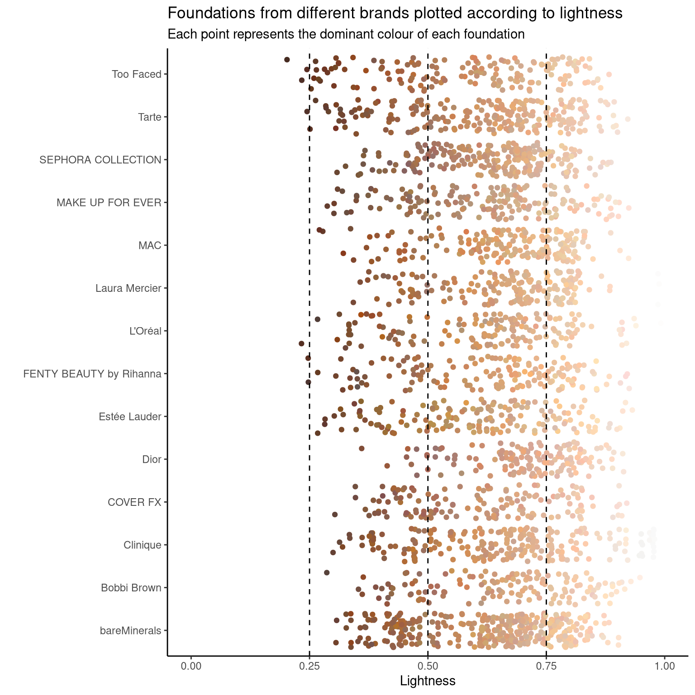
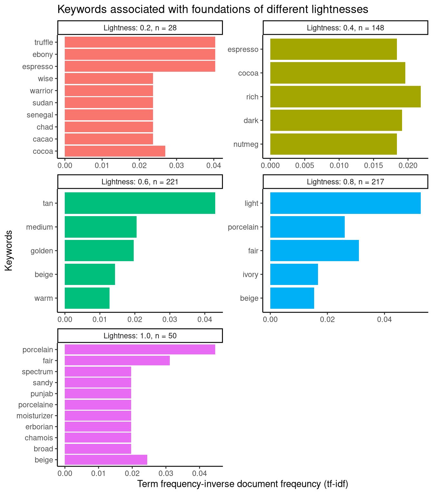

## Setup and data preparation

Loading the `R` libraries and [data set](https://github.com/rfordatascience/tidytuesday/blob/master/data/2021/2021-03-30/readme.md).

<div class="layout-chunk" data-layout="l-body">
<details>
<summary>Show code</summary>
<div class="sourceCode"><pre class="sourceCode r"><code class="sourceCode r"><span class='co'># Loading libraries</span>
<span class='kw'><a href='https://rdrr.io/r/base/library.html'>library</a></span><span class='op'>(</span><span class='va'><a href='https://tidyverse.tidyverse.org'>tidyverse</a></span><span class='op'>)</span>
<span class='kw'><a href='https://rdrr.io/r/base/library.html'>library</a></span><span class='op'>(</span><span class='va'><a href='https://github.com/thebioengineer/tidytuesdayR'>tidytuesdayR</a></span><span class='op'>)</span>
<span class='kw'><a href='https://rdrr.io/r/base/library.html'>library</a></span><span class='op'>(</span><span class='va'><a href='https://sjmgarnier.github.io/viridis/'>viridis</a></span><span class='op'>)</span>
<span class='kw'><a href='https://rdrr.io/r/base/library.html'>library</a></span><span class='op'>(</span><span class='va'><a href='https://github.com/juliasilge/tidytext'>tidytext</a></span><span class='op'>)</span>
<span class='kw'><a href='https://rdrr.io/r/base/library.html'>library</a></span><span class='op'>(</span><span class='va'><a href='https://forcats.tidyverse.org'>forcats</a></span><span class='op'>)</span>
<span class='kw'><a href='https://rdrr.io/r/base/library.html'>library</a></span><span class='op'>(</span><span class='va'><a href='https://wilkelab.org/ggridges/'>ggridges</a></span><span class='op'>)</span>

<span class='co'># Loading data set</span>
<span class='va'>tt</span> <span class='op'>&lt;-</span> <span class='fu'><a href='https://rdrr.io/pkg/tidytuesdayR/man/tt_load.html'>tt_load</a></span><span class='op'>(</span><span class='st'>"2021-03-30"</span><span class='op'>)</span>
</code></pre></div>

</details>

```

	Downloading file 1 of 5: `ulta.csv`
	Downloading file 2 of 5: `sephora.csv`
	Downloading file 3 of 5: `allShades.csv`
	Downloading file 4 of 5: `allNumbers.csv`
	Downloading file 5 of 5: `allCategories.csv`
```

</div>


Wrangling data for visualisation.

<div class="layout-chunk" data-layout="l-body">
<details>
<summary>Show code</summary>
<div class="sourceCode"><pre class="sourceCode r"><code class="sourceCode r"><span class='co'># Selecting the 14 brands with the most foundations in the data set as</span>
<span class='co'># "top_brands"</span>
<span class='va'>top_brands</span> <span class='op'>&lt;-</span> <span class='va'>tt</span><span class='op'>$</span><span class='va'>allShades</span> <span class='op'>%&gt;%</span>
  <span class='fu'>select</span><span class='op'>(</span><span class='va'>brand</span><span class='op'>)</span> <span class='op'>%&gt;%</span>
  <span class='fu'>count</span><span class='op'>(</span><span class='va'>brand</span><span class='op'>)</span> <span class='op'>%&gt;%</span>
  <span class='fu'>slice_max</span><span class='op'>(</span>order_by <span class='op'>=</span> <span class='va'>n</span>, n <span class='op'>=</span> <span class='fl'>14</span><span class='op'>)</span>

<span class='co'># Selecting foundation names broken into individual words and lightness values </span>
<span class='co'># rounded to the nearest significant digit as "simplified_names"</span>
<span class='va'>simplified_names</span> <span class='op'>&lt;-</span> <span class='va'>tt</span><span class='op'>$</span><span class='va'>allShades</span> <span class='op'>%&gt;%</span>
  <span class='fu'>mutate</span><span class='op'>(</span>rounded <span class='op'>=</span> <span class='fu'><a href='https://rdrr.io/r/base/Round.html'>signif</a></span><span class='op'>(</span><span class='va'>lightness</span>, digits <span class='op'>=</span> <span class='fl'>1</span><span class='op'>)</span><span class='op'>)</span> <span class='op'>%&gt;%</span>
  <span class='fu'><a href='https://rdrr.io/r/stats/filter.html'>filter</a></span><span class='op'>(</span><span class='op'>!</span><span class='fu'><a href='https://rdrr.io/r/base/NA.html'>is.na</a></span><span class='op'>(</span><span class='va'>name</span><span class='op'>)</span><span class='op'>)</span> <span class='op'>%&gt;%</span>
  <span class='fu'><a href='https://rdrr.io/r/stats/filter.html'>filter</a></span><span class='op'>(</span><span class='va'>rounded</span> <span class='op'>%in%</span> <span class='fu'><a href='https://rdrr.io/r/base/c.html'>c</a></span><span class='op'>(</span><span class='fl'>0.2</span>, <span class='fl'>0.4</span>, <span class='fl'>0.6</span>, <span class='fl'>0.8</span>, <span class='fl'>1.0</span><span class='op'>)</span><span class='op'>)</span> <span class='op'>%&gt;%</span>
  <span class='fu'>select</span><span class='op'>(</span><span class='va'>name</span>, <span class='va'>rounded</span><span class='op'>)</span> <span class='op'>%&gt;%</span>
  <span class='fu'><a href='https://rdrr.io/pkg/tidytext/man/unnest_tokens.html'>unnest_tokens</a></span><span class='op'>(</span><span class='va'>word</span>, <span class='va'>name</span><span class='op'>)</span> <span class='op'>%&gt;%</span>
  <span class='fu'>count</span><span class='op'>(</span><span class='va'>rounded</span>, <span class='va'>word</span>, sort <span class='op'>=</span> <span class='cn'>T</span><span class='op'>)</span>

<span class='co'># Counting the total number of words per rounded lightness value</span>
<span class='va'>total_words</span> <span class='op'>&lt;-</span> <span class='va'>simplified_names</span> <span class='op'>%&gt;%</span>
  <span class='fu'>group_by</span><span class='op'>(</span><span class='va'>rounded</span><span class='op'>)</span> <span class='op'>%&gt;%</span>
  <span class='fu'>summarise</span><span class='op'>(</span>total <span class='op'>=</span> <span class='fu'><a href='https://rdrr.io/r/base/sum.html'>sum</a></span><span class='op'>(</span><span class='va'>n</span><span class='op'>)</span><span class='op'>)</span>

<span class='co'># Added word count totals and tf-idf values to "simplified_names", and changing</span>
<span class='co'># "rounded" to a factor variable with informative levels</span>
<span class='va'>simplified_names</span> <span class='op'>&lt;-</span> <span class='fu'>left_join</span><span class='op'>(</span><span class='va'>simplified_names</span>, <span class='va'>total_words</span>, by <span class='op'>=</span> <span class='st'>"rounded"</span><span class='op'>)</span>
<span class='va'>simplified_names</span> <span class='op'>&lt;-</span> <span class='va'>simplified_names</span> <span class='op'>%&gt;%</span>
  <span class='fu'><a href='https://rdrr.io/pkg/tidytext/man/bind_tf_idf.html'>bind_tf_idf</a></span><span class='op'>(</span><span class='va'>word</span>, <span class='va'>rounded</span>, <span class='va'>n</span><span class='op'>)</span>
<span class='va'>simplified_names</span><span class='op'>$</span><span class='va'>rounded</span> <span class='op'>&lt;-</span> <span class='fu'><a href='https://rdrr.io/r/base/factor.html'>as.factor</a></span><span class='op'>(</span><span class='va'>simplified_names</span><span class='op'>$</span><span class='va'>rounded</span><span class='op'>)</span>
<span class='fu'><a href='https://rdrr.io/r/base/table.html'>table</a></span><span class='op'>(</span><span class='va'>simplified_names</span><span class='op'>$</span><span class='va'>rounded</span><span class='op'>)</span>
</code></pre></div>

</details>

```

0.2 0.4 0.6 0.8   1 
 28 148 221 217  50 
```

<details>
<summary>Show code</summary>
<div class="sourceCode"><pre class="sourceCode r"><code class="sourceCode r"><span class='fu'><a href='https://rdrr.io/r/base/levels.html'>levels</a></span><span class='op'>(</span><span class='va'>simplified_names</span><span class='op'>$</span><span class='va'>rounded</span><span class='op'>)</span> <span class='op'>&lt;-</span> <span class='fu'><a href='https://rdrr.io/r/base/c.html'>c</a></span><span class='op'>(</span><span class='st'>"Lightness: 0.2, n = 28"</span>,
                                      <span class='st'>"Lightness: 0.4, n = 148"</span>,
                                      <span class='st'>"Lightness: 0.6, n = 221"</span>,
                                      <span class='st'>"Lightness: 0.8, n = 217"</span>,
                                      <span class='st'>"Lightness: 1.0, n = 50"</span><span class='op'>)</span>
<span class='va'>simplified_names</span>
</code></pre></div>

</details>

```
# A tibble: 664 x 7
   rounded                 word       n total     tf   idf tf_idf
   <fct>                   <chr>  <int> <int>  <dbl> <dbl>  <dbl>
 1 Lightness: 0.8, n = 217 light    156  1512 0.103  0.511 0.0527
 2 Lightness: 0.6, n = 221 medium   129  1401 0.0921 0.223 0.0205
 3 Lightness: 0.6, n = 221 tan      118  1401 0.0842 0.511 0.0430
 4 Lightness: 0.8, n = 217 ivory    113  1512 0.0747 0.223 0.0167
 5 Lightness: 0.8, n = 217 beige    104  1512 0.0688 0.223 0.0153
 6 Lightness: 0.4, n = 148 deep      99   748 0.132  0     0     
 7 Lightness: 0.8, n = 217 fair      92  1512 0.0608 0.511 0.0311
 8 Lightness: 0.6, n = 221 beige     90  1401 0.0642 0.223 0.0143
 9 Lightness: 0.8, n = 217 warm      82  1512 0.0542 0.223 0.0121
10 Lightness: 0.6, n = 221 warm      80  1401 0.0571 0.223 0.0127
# … with 654 more rows
```

</div>


## Plotting foundations according to lightness

In this plot, each point represents a single foundation from the 14 most
represented brands in the data set. The colour of each point corresponds to
the dominant shade of each foundation. These points are arranged according to
the lightness of each foundation.

<div class="layout-chunk" data-layout="l-body">
<details>
<summary>Show code</summary>
<div class="sourceCode"><pre class="sourceCode r"><code class="sourceCode r"><span class='co'># Plotting all the foundations from "top_brands" according to lightness</span>
<span class='va'>tt</span><span class='op'>$</span><span class='va'>allShades</span> <span class='op'>%&gt;%</span>
  <span class='fu'><a href='https://rdrr.io/r/stats/filter.html'>filter</a></span><span class='op'>(</span><span class='va'>brand</span> <span class='op'>%in%</span> <span class='va'>top_brands</span><span class='op'>$</span><span class='va'>brand</span><span class='op'>)</span> <span class='op'>%&gt;%</span>
  <span class='fu'>ggplot</span><span class='op'>(</span><span class='fu'>aes</span><span class='op'>(</span><span class='va'>lightness</span>, <span class='va'>brand</span>, colour <span class='op'>=</span> <span class='va'>hex</span><span class='op'>)</span><span class='op'>)</span> <span class='op'>+</span>
  <span class='fu'>geom_jitter</span><span class='op'>(</span><span class='op'>)</span> <span class='op'>+</span>
  <span class='fu'>scale_colour_identity</span><span class='op'>(</span><span class='op'>)</span> <span class='op'>+</span>
  <span class='fu'><a href='https://rdrr.io/r/graphics/plot.window.html'>xlim</a></span><span class='op'>(</span><span class='fl'>0</span>, <span class='fl'>1</span><span class='op'>)</span> <span class='op'>+</span>
  <span class='fu'>theme_classic</span><span class='op'>(</span><span class='op'>)</span> <span class='op'>+</span>
  <span class='fu'>geom_vline</span><span class='op'>(</span>xintercept <span class='op'>=</span> <span class='fl'>0.25</span>, linetype <span class='op'>=</span> <span class='st'>"dashed"</span><span class='op'>)</span> <span class='op'>+</span>
  <span class='fu'>geom_vline</span><span class='op'>(</span>xintercept <span class='op'>=</span> <span class='fl'>0.50</span>, linetype <span class='op'>=</span> <span class='st'>"dashed"</span><span class='op'>)</span> <span class='op'>+</span>
  <span class='fu'>geom_vline</span><span class='op'>(</span>xintercept <span class='op'>=</span> <span class='fl'>0.75</span>, linetype <span class='op'>=</span> <span class='st'>"dashed"</span><span class='op'>)</span> <span class='op'>+</span>
  <span class='fu'>labs</span><span class='op'>(</span>y <span class='op'>=</span> <span class='st'>""</span>, x <span class='op'>=</span> <span class='st'>"Lightness"</span>,
       title <span class='op'>=</span> <span class='st'>"Foundations from different brands plotted according to lightness"</span>,
       subtitle <span class='op'>=</span> <span class='st'>"Each point represents the dominant colour of each foundation"</span><span class='op'>)</span>
</code></pre></div>

</details>

</div>


## Plotting distributions of foundation lightness

In this plot, the distributions of foundations from the brands in the previous
graph are plotted according to lightness. Across all these brands, lighter
shades are more represented than darker shades.

<div class="layout-chunk" data-layout="l-body">
<details>
<summary>Show code</summary>
<div class="sourceCode"><pre class="sourceCode r"><code class="sourceCode r"><span class='co'># Plotting the distribution of foundations from "top_brands" according to</span>
<span class='co'># lightness</span>
<span class='va'>tt</span><span class='op'>$</span><span class='va'>allShades</span> <span class='op'>%&gt;%</span>
  <span class='fu'><a href='https://rdrr.io/r/stats/filter.html'>filter</a></span><span class='op'>(</span><span class='va'>brand</span> <span class='op'>%in%</span> <span class='va'>top_brands</span><span class='op'>$</span><span class='va'>brand</span><span class='op'>)</span> <span class='op'>%&gt;%</span>
  <span class='fu'>ggplot</span><span class='op'>(</span><span class='fu'>aes</span><span class='op'>(</span><span class='va'>lightness</span>, <span class='va'>brand</span>, fill <span class='op'>=</span> <span class='va'>brand</span>, group <span class='op'>=</span> <span class='va'>brand</span><span class='op'>)</span><span class='op'>)</span> <span class='op'>+</span>
  <span class='fu'><a href='https://wilkelab.org/ggridges/reference/geom_ridgeline_gradient.html'>geom_density_ridges_gradient</a></span><span class='op'>(</span><span class='op'>)</span> <span class='op'>+</span>
  <span class='fu'><a href='https://sjmgarnier.github.io/viridis/reference/scale_viridis.html'>scale_fill_viridis</a></span><span class='op'>(</span>discrete <span class='op'>=</span> <span class='cn'>TRUE</span><span class='op'>)</span> <span class='op'>+</span>
  <span class='fu'><a href='https://rdrr.io/r/graphics/plot.window.html'>xlim</a></span><span class='op'>(</span><span class='fl'>0</span>, <span class='fl'>1</span><span class='op'>)</span> <span class='op'>+</span>
  <span class='fu'><a href='https://wilkelab.org/ggridges/reference/theme_ridges.html'>theme_ridges</a></span><span class='op'>(</span><span class='op'>)</span> <span class='op'>+</span>
  <span class='fu'>geom_vline</span><span class='op'>(</span>xintercept <span class='op'>=</span> <span class='fl'>0.25</span>, linetype <span class='op'>=</span> <span class='st'>"dashed"</span><span class='op'>)</span> <span class='op'>+</span>
  <span class='fu'>geom_vline</span><span class='op'>(</span>xintercept <span class='op'>=</span> <span class='fl'>0.50</span>, linetype <span class='op'>=</span> <span class='st'>"dashed"</span><span class='op'>)</span> <span class='op'>+</span>
  <span class='fu'>geom_vline</span><span class='op'>(</span>xintercept <span class='op'>=</span> <span class='fl'>0.75</span>, linetype <span class='op'>=</span> <span class='st'>"dashed"</span><span class='op'>)</span> <span class='op'>+</span>
  <span class='fu'>theme</span><span class='op'>(</span>legend.position <span class='op'>=</span> <span class='st'>"none"</span><span class='op'>)</span> <span class='op'>+</span>
  <span class='fu'>labs</span><span class='op'>(</span>y <span class='op'>=</span> <span class='st'>"Brands"</span>, x <span class='op'>=</span> <span class='st'>"Lightness"</span>,
       title <span class='op'>=</span> <span class='st'>"Foundation shade distributions"</span>,
       subtitle <span class='op'>=</span> <span class='st'>"Distribution of foundations from different brands according to lightness"</span><span class='op'>)</span>
</code></pre></div>

</details>

</div>


## Plotting keywords associated with foundations of different shades

In this section, keywords associated with foundations of different shades are
plotted. This is done by...

- taking all the available foundation names as a corpus
- splitting that corpus into different documents based on rounded lightness values
- calculating [tf-idf](https://www.tidytextmining.com/tfidf.html) to find
significant words used to describe foundations according to their shade

From this plot, we can see that the darkest ("Lightness: 0.2") and lightest
("Lightness: 0.8") foundations are associated with more descriptive, unique
keywords than the intermediate shades.

<div class="layout-chunk" data-layout="l-body">
<details>
<summary>Show code</summary>
<div class="sourceCode"><pre class="sourceCode r"><code class="sourceCode r"><span class='va'>simplified_names</span> <span class='op'>%&gt;%</span>
  <span class='fu'>group_by</span><span class='op'>(</span><span class='va'>rounded</span><span class='op'>)</span> <span class='op'>%&gt;%</span>
  <span class='fu'>slice_max</span><span class='op'>(</span>n <span class='op'>=</span> <span class='fl'>5</span>, order_by <span class='op'>=</span> <span class='va'>tf_idf</span><span class='op'>)</span> <span class='op'>%&gt;%</span>
  <span class='fu'>ungroup</span><span class='op'>(</span><span class='op'>)</span> <span class='op'>%&gt;%</span>
  <span class='fu'>ggplot</span><span class='op'>(</span><span class='fu'>aes</span><span class='op'>(</span><span class='va'>tf_idf</span>, <span class='fu'><a href='https://forcats.tidyverse.org/reference/fct_reorder.html'>fct_reorder</a></span><span class='op'>(</span><span class='va'>word</span>, <span class='va'>tf_idf</span><span class='op'>)</span>, fill <span class='op'>=</span> <span class='va'>rounded</span><span class='op'>)</span><span class='op'>)</span> <span class='op'>+</span>
  <span class='fu'>geom_col</span><span class='op'>(</span>show.legend <span class='op'>=</span> <span class='cn'>FALSE</span><span class='op'>)</span> <span class='op'>+</span>
  <span class='fu'>facet_wrap</span><span class='op'>(</span><span class='op'>~</span><span class='va'>rounded</span>, ncol <span class='op'>=</span> <span class='fl'>2</span>, scales <span class='op'>=</span> <span class='st'>"free"</span><span class='op'>)</span> <span class='op'>+</span>
  <span class='fu'>theme_classic</span><span class='op'>(</span><span class='op'>)</span> <span class='op'>+</span>
  <span class='fu'>labs</span><span class='op'>(</span>x <span class='op'>=</span> <span class='st'>"Term frequency-inverse document freqeuncy (tf-idf)"</span>, y <span class='op'>=</span> <span class='st'>"Keywords"</span>,
       title <span class='op'>=</span> <span class='st'>"Keywords associated with foundations of different lightnesses"</span><span class='op'>)</span>
</code></pre></div>

</details>

</div>

```{.r .distill-force-highlighting-css}
```
